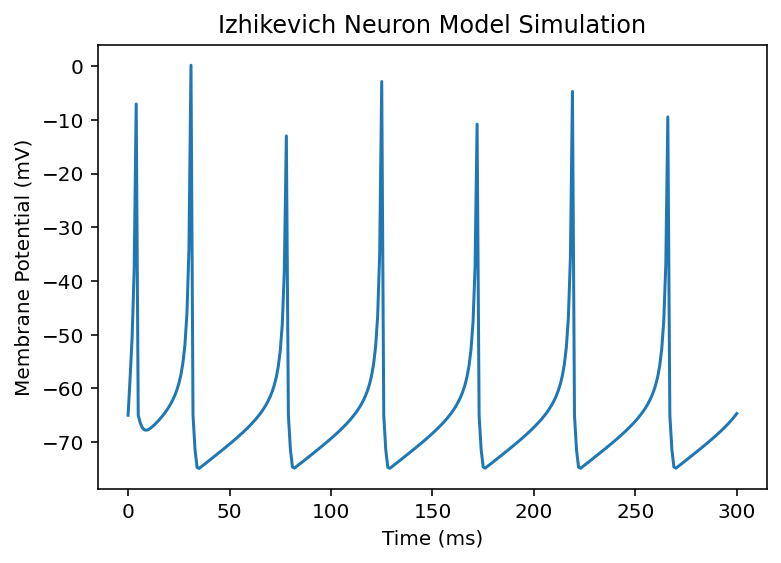

# Izhikevich Neuron Model Simulation

This project simulates a single neuron using the Izhikevich model, which captures spiking behavior with a simple mathematical model.
The neuron updates its membrane potential (v) and recovery variable (u) at each time step using Izhikevich model equation:

v' = 0.04v² + 5v + 140 - u + I  
u' = a(bv - u)  

## Parameters

- a, b, c, d: Model constants defining neuron dynamics  
- I: Input current  
- T: Total simulation time  
- dt: Time step for simulation  

## Sample Output

